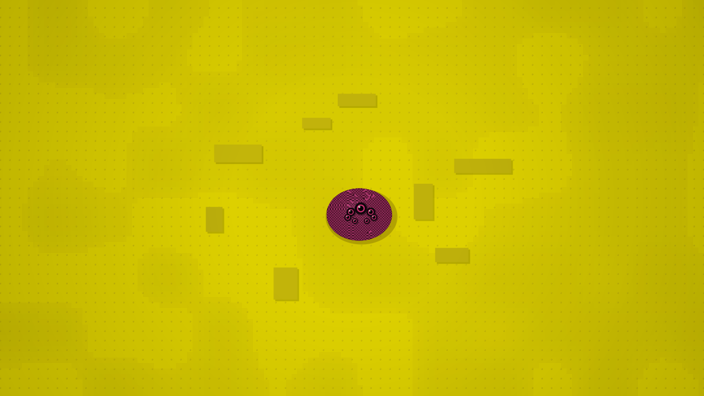
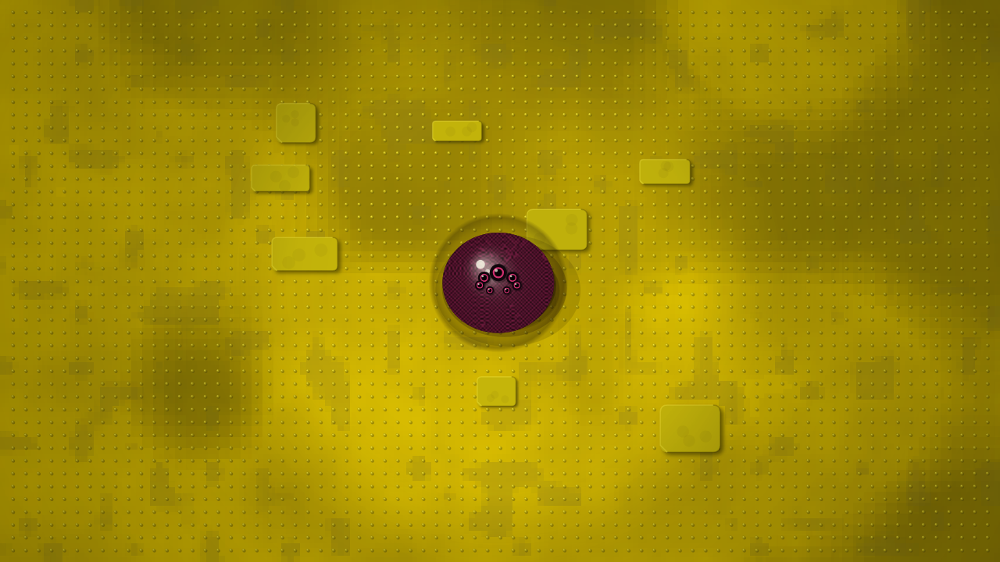
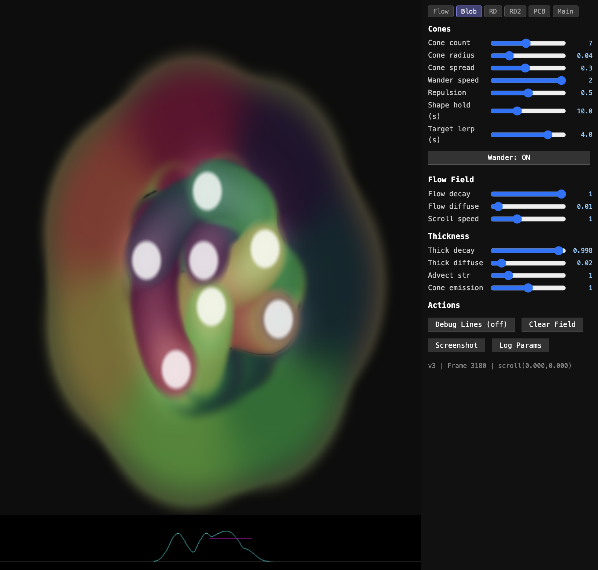
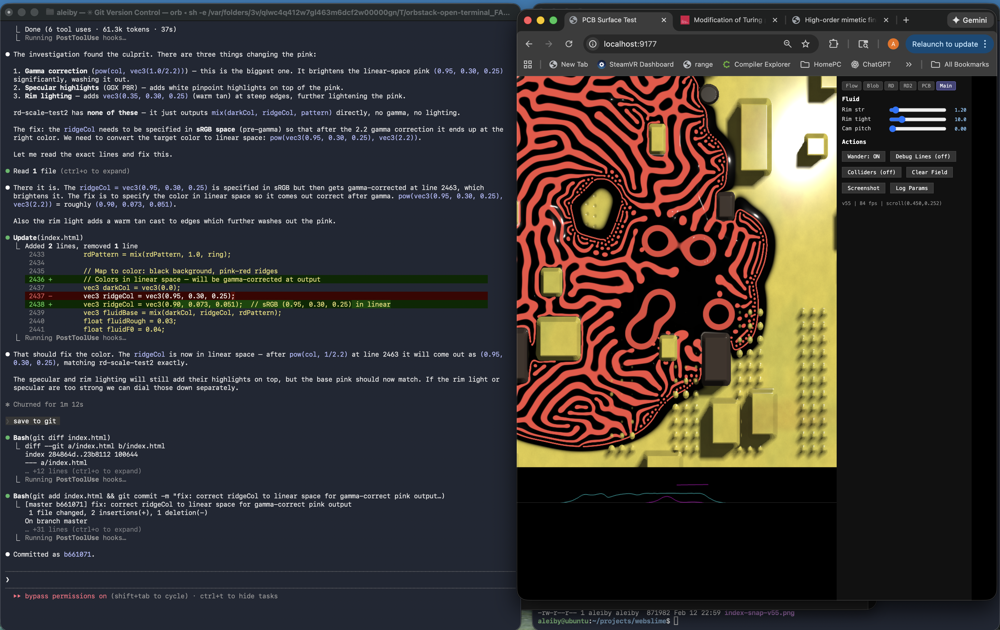

# Development History

### Feb 8 - First prototype ([plan](plans/00-project-overview.md))

### Feb 8 - Shadows and lighting

### Feb 9 - Agent-driven development

### Feb 9 - Heightmap and PCB surface

### Feb 10 - UI sliders and RD patterns

### Feb 11 - Flow field and thickness tuning

### Feb 12 - PCB surface and maze layout

### Feb 13 - PBR materials and integration

